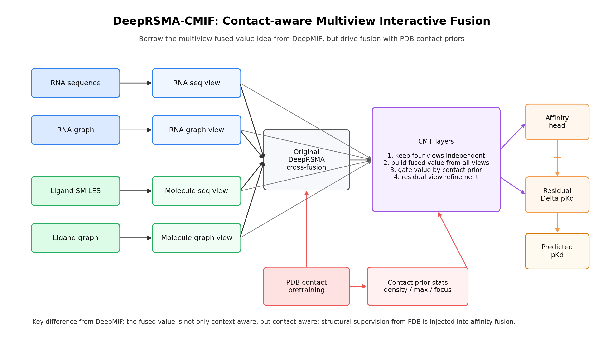
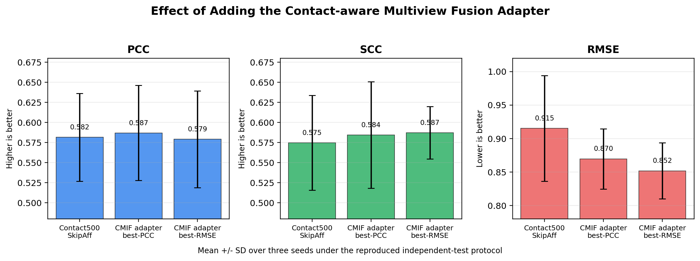

# DeepRSMA-CMIF: 面向 RNA-小分子结合亲和力预测的结构接触监督多视图交互融合方法

> 中文论文初稿。本文档参考 DeepRSMA 与 DeepMIF 两篇文章的通用组织结构撰写，但方法叙事、实验结果和图表均围绕当前项目的实际代码与日志整理。投稿前仍需补充英文润色、正式参考文献格式、统计显著性检验、严格 validation-selected protocol 以及必要的补充实验。

## 摘要

**研究动机：** RNA 靶向小分子药物发现正在成为计算药物设计的重要方向。准确预测 RNA-小分子结合亲和力有助于加速候选化合物筛选，但该任务仍面临两个关键挑战：一是具备定量亲和力标签的 RNA-ligand 数据规模有限；二是多数亲和力数据仅提供 RNA 序列、小分子 SMILES 和 pKd 等全局标签，缺少 nucleotide-atom 级别的结合接触标注，导致模型难以学习和解释 RNA 与配体之间的局部物理相互作用。

**方法：** 本文提出 DeepRSMA-CMIF，一种结合 PDB-derived nucleotide-atom contact supervision 与 contact-aware multiview interactive fusion 的 RNA-小分子结合亲和力预测框架。方法首先保留 DeepRSMA 的四分支主干，包括 RNA sequence view、RNA graph view、molecule sequence view 和 molecule graph view，并利用 PDB RNA-ligand 复合物自动生成 nucleotide-atom contact map 进行结构接触预训练。随后，在已完成 contact-supervised fine-tuning 的模型后接入一个轻量级 CMIF adapter。该模块借鉴多视图交互融合思想，但不是简单复现已有 fused-value attention，而是进一步将 contact prior 注入四视图交互过程，使 contact map 从辅助监督信号升级为影响内部融合机制的结构先验。

**结果：** 在 PDB Contact500 数据集上，真实 contact pretraining 在 contact validation split 上达到 top-k precision 0.3471、AUPRC 0.2847 和 AUROC 0.8828，明显优于 shuffled-label control。将 contact pretraining 迁移到 R-SIM independent-test 协议后，Contact500SkipAff 相比复现的原始 DeepRSMA 将 PCC 从 0.4866 提升至 0.5816，并将 RMSE 从 1.0584 降低至 0.9152。进一步地，在 Contact500SkipAff 后接入 CMIF adapter 后，三种子 best-PCC 平均结果进一步达到 PCC 0.5870、SCC 0.5844 和 RMSE 0.8696；best-RMSE 选择下 RMSE 进一步降低至 0.8518。

**结论：** 本研究表明，PDB-derived nucleotide-atom contact supervision 能够为 RNA-小分子亲和力预测提供有效的结构先验；进一步将 contact prior 注入多视图交互融合过程，可以在保留 DeepRSMA 原有四分支主干的基础上增强模型表达能力和可解释性。DeepRSMA-CMIF 为 RNA 靶向小分子虚拟筛选提供了一种结构监督驱动的可扩展建模思路。

**关键词：** RNA-small molecule interaction；binding affinity prediction；DeepRSMA；contact map；PDB structure supervision；multiview interactive fusion；interpretability

## 1. 引言

RNA 参与转录、翻译、剪接、基因调控和疾病相关信号通路等多种生物过程。随着 RNA 靶点在遗传病、肿瘤、病毒感染和抗菌治疗中的价值不断提升，RNA 靶向小分子药物发现逐渐成为计算药物设计的重要方向。与蛋白质靶点相比，RNA 靶点具有独特的二级结构、柔性构象和局部口袋特征，因此 RNA-小分子结合亲和力预测不能简单照搬传统 protein-ligand 预测范式。

实验测定 RNA-小分子亲和力通常需要较高成本和较长周期。计算方法能够在早期筛选阶段减少实验负担，因此已有研究尝试使用分子指纹、打分函数、机器学习模型和深度学习模型预测 RNA-small molecule binding affinity。近年来，DeepRSMA 提出了一个 cross-fusion-based deep learning framework，通过 RNA sequence、RNA graph、molecule sequence 和 molecule graph 四个视图提取多源表征，并使用 cross-fusion module 建模 RNA 与小分子的相互作用。其消融实验表明 graph view、sequence view 和 cross-fusion module 均对最终性能有贡献。

然而，现有方法仍存在两个不足。首先，亲和力数据集通常只提供全局 pKd 标签，模型被迫从弱监督信号中学习复杂的 nucleotide-atom interaction。其次，即使模型能够输出较好的 pKd 预测，也难以解释具体哪些 RNA nucleotide 与 ligand atom 发生了物理接触。对于 RNA-targeted drug design 而言，模型能否定位 binding pocket 和关键相互作用位点，与模型的实际应用价值密切相关。

DeepMIF 进一步提出 multiview interactive fusion 思路，强调在融合过程中保持 drug sequence、drug graph、RNA sequence 和 RNA graph 四个视图的独立性，并通过 context-aware fused value mechanism 建模多视图交互。该思想提示我们：如果只是把所有视图过早压缩成 RNA 和 ligand 两个实体向量，可能会损失局部视图间的互补信息。对于 RNA-ligand 任务而言，更合理的方向是让四个视图在融合阶段持续交互，并让结构接触先验参与该交互过程。

基于上述观察，本文提出 DeepRSMA-CMIF。与 DeepRSMA 相比，本文额外引入 PDB-derived nucleotide-atom contact supervision，使模型先学习 RNA-ligand 复合物中的物理接触模式。与 DeepMIF 相比，本文不直接照搬 RNA-FM/L-ESKmer 或普通 fused-value attention，而是将 contact prediction head 产生的 structural prior 注入 multiview interactive fusion，构建 contact-aware fused value。这样，contact map 不再只是额外输出或可解释性分析工具，而是成为模型内部融合机制的一部分。

本文主要贡献如下：

1. 提出 PDB-derived nucleotide-atom contact supervision，用 RNA-ligand 复合物结构自动生成 contact map，缓解 R-SIM 等 affinity 数据集中缺少 binding-site annotation 的问题。
2. 在 DeepRSMA 四分支主干上构建 contact-supervised pretraining and fine-tuning framework，使模型在预测 pKd 前学习 RNA nucleotide 与 ligand atom 的局部物理接触模式。
3. 提出 contact-aware multiview interactive fusion adapter，在已训练好的 Contact500SkipAff 模型后注入 CMIF residual adapter，保持原模型能力的同时增强四视图交互。
4. 通过 true contact、shuffled contact、de-overlap contact、contact data scaling 和 downstream affinity evaluation 构建证据链，验证 contact supervision 的有效性。
5. 通过 contact map visualization 和 PDB 3D structure case study，将模型解释从全局 affinity prediction 扩展到 nucleotide-atom interaction 层面。

## 2. 材料与方法

### 2.1 任务定义

给定 RNA \(R\) 和小分子 \(M\)，目标是预测二者的结合亲和力 \(y\)，本文使用 pKd 作为回归标签。RNA 由 sequence view 和 graph view 表示，小分子由 SMILES sequence view 和 molecular graph view 表示。

对于 PDB RNA-ligand 复合物，本文额外定义 nucleotide-atom contact map：

\[
C \in \{0,1\}^{p \times q},
\]

其中 \(p\) 为 RNA nucleotide 数量，\(q\) 为 ligand heavy atom 数量。若第 \(i\) 个 nucleotide 与第 \(j\) 个 ligand atom 的最近 heavy-atom 距离小于 4 Angstrom，则：

\[
C_{ij}=1,
\]

否则：

\[
C_{ij}=0.
\]

该 contact map 作为结构接触监督信号，用于模型预训练和后续 contact prior 构建。

### 2.2 DeepRSMA backbone

本文保留 DeepRSMA 的四个核心输入分支：

- RNA sequence embedding；
- RNA graph embedding；
- molecule sequence embedding；
- molecule graph embedding。

RNA graph branch 建模 RNA nucleotide 之间的结构关系，RNA sequence branch 捕获局部序列模式；molecule graph branch 表示 atom-level topology，molecule sequence branch 表示 SMILES token-level 信息。四个分支经过原始 DeepRSMA cross-fusion module 后得到 RNA 与 molecule 的交互表示，再由 affinity head 输出 pKd。

本文保留该主干结构的原因有两个。第一，原 DeepRSMA 的消融实验已经说明 graph view、sequence view 和 cross-fusion 均有贡献。第二，本文的目标不是推翻原模型，而是在已有 RNA-ligand 多视图框架中引入结构接触监督和更细粒度的融合机制。

**图 1. Contact-supervised DeepRSMA framework。** PDB RNA-ligand 复合物首先被转换为 nucleotide-atom contact maps，模型使用这些结构标签进行 contact pretraining，再迁移到 R-SIM pKd prediction。

### 2.3 PDB-derived contact map 构建

本文从 PDB RNA-ligand complexes 中自动构建 contact supervision。对于每个复合物，解析 RNA chain 和 ligand heavy atoms，计算 nucleotide 与 ligand atom 的最近距离。若距离小于 4 Angstrom，则标记为 positive contact。

构建流程如下：

1. 查询包含 RNA polymer 和非聚合小分子的 PDB structures。
2. 过滤水、常见离子、异常 ligand 和不满足距离条件的样本。
3. 解析 RNA nucleotide 坐标和 ligand heavy atom 坐标。
4. 生成 \(p \times q\) binary contact map。
5. 保存 RNA sequence、ligand SMILES、ligand graph 和 contact map。

最终得到 Contact500 数据集，共 484 个可用 RNA-ligand contact samples。为评估潜在数据泄漏，还构建了 de-overlap Contact500：通过 ligand Tanimoto similarity 和 RNA sequence window identity 移除与 independent test 相似的样本，保留 440 个 samples。

**图 2. PDB-derived contact dataset statistics。** 扩大 PDB contact pretraining 数据后，样本数、ligand 类型、positive contacts 和 nucleotide-atom pairs 均显著增加。

### 2.4 Contact prediction head

设 cross-fusion 后第 \(i\) 个 RNA nucleotide embedding 为 \(r_i\)，第 \(j\) 个 ligand atom embedding 为 \(m_j\)。Contact head 使用 pairwise MLP 预测 contact logit：

\[
s_{ij} = \mathrm{MLP}([r_i, m_j, r_i \odot m_j]),
\]

其中 \(\odot\) 表示 element-wise multiplication。所有 pairwise logits 构成 contact logit matrix：

\[
S \in \mathbb{R}^{p \times q}.
\]

由于 contact map 中正样本比例很低，本文使用 focal loss 作为 contact pretraining 目标：

\[
\mathcal{L}_{contact}
= -\alpha(1-p_t)^\gamma \log(p_t),
\]

其中 \(\alpha=0.75\)，\(\gamma=2.0\)。

### 2.5 两阶段结构监督训练

DeepRSMA-CMIF 的第一阶段为结构接触预训练：

\[
R, M \rightarrow C.
\]

模型在 PDB-derived contact map 上学习 nucleotide-atom contact prediction，优化目标为：

\[
\mathcal{L}_{stage1}=\mathcal{L}_{contact}.
\]

第二阶段为亲和力微调：

\[
R, M \rightarrow \hat{y}.
\]

模型迁移 contact-pretrained backbone 到 R-SIM affinity dataset，并使用 MSE loss 训练 pKd prediction：

\[
\mathcal{L}_{affinity} = \mathrm{MSE}(\hat{y}, y).
\]

在 Contact500SkipAff 设置中，迁移 contact-pretrained backbone，但跳过 contact pretraining 阶段未充分训练的 affinity head，使下游 affinity head 在 R-SIM 上重新学习。

### 2.6 Contact-aware multiview interactive fusion

为了进一步扩大结构创新，本文在 Contact500SkipAff 后引入 CMIF adapter。该模块借鉴多视图交互融合思想，但与普通 multiview fusion 不同，CMIF 将 contact prior 显式注入 fused value generation。

CMIF 接收四个全局视图向量：

\[
H=[h_{RS},h_{RG},h_{MS},h_{MG}],
\]

分别对应 RNA sequence view、RNA graph view、molecule sequence view 和 molecule graph view。

同时，contact head 输出 nucleotide-atom contact probability matrix \(P\)。从 \(P\) 中提取四个 contact prior statistics：

\[
c=[density, max\_prob, rna\_focus, atom\_focus].
\]

在第 \(l\) 层中，CMIF 首先根据四视图上下文和 contact prior 生成 view gate：

\[
g^{(l)}=\mathrm{softmax}(\mathrm{MLP}([H^{(l-1)},c])).
\]

然后构建 contact-aware fused value：

\[
v_{fused}^{(l)}=W_{vf}\sum_k g_k^{(l)}h_k^{(l-1)}.
\]

多视图 attention 分数为：

\[
A^{(l)}=\mathrm{softmax}\left(\frac{Q(H)K(H)^T}{\sqrt{d}}\right).
\]

与标准 attention 不同，CMIF 的 value 项由单视图 value 和 contact-aware fused value 共同组成：

\[
V_{contact}^{(l)}=V(H)+v_{fused}^{(l)}.
\]

最终视图更新为：

\[
H^{(l)}=\mathrm{LN}(H^{(l-1)}+A^{(l)}V_{contact}^{(l)}),
\]

\[
H^{(l)}=\mathrm{LN}(H^{(l)}+\mathrm{FFN}(H^{(l)})).
\]

**图 3. DeepRSMA-CMIF method overview。** CMIF 在 DeepRSMA 四视图表示之后执行 contact-aware multiview interactive fusion。Contact prior 不直接替代 affinity head，而是参与 fused value generation，使结构接触信息影响视图间交互。

### 2.7 CMIF residual adapter

为了避免新增模块破坏已训练好的 Contact500SkipAff 模型，本文采用 residual adapter 设计。具体而言，首先加载已经 fine-tune 好的 Contact500SkipAff checkpoint，并冻结原模型参数；随后只训练新增的 CMIF adapter。预测值写作：

\[
\hat{y}_{CMIF}=\hat{y}_{base}+\Delta y_{CMIF}.
\]

其中 \(\hat{y}_{base}\) 为 Contact500SkipAff 输出，\(\Delta y_{CMIF}\) 为 CMIF adapter 学到的 residual correction。CMIF residual head 最后一层采用零初始化，因此训练开始前模型输出严格等于原 Contact500SkipAff 输出。这一设置保证新模块是在已有最好方案后进行增量增强，而不是重新训练一个不可控的新模型。

### 2.8 对照实验设计

本文设置以下对照实验：

**Shuffled contact control。** 在每个 PDB 样本内随机打乱 contact map，保持 positive contact 数量和 contact density 不变，但破坏 nucleotide-atom correspondence。若 shuffled model 无法复现真实 contact model 的效果，则说明有效信号来自真实物理接触关系。

**De-overlap control。** 移除与 independent test 在 ligand fingerprint 或 RNA sequence 上相似的 PDB contact samples，用于评估 contact pretraining 是否依赖潜在数据重叠。

**Contact data scaling。** 比较 0、94 和 484 个 contact samples 对下游 affinity prediction 的影响，评估结构监督规模是否带来可扩展收益。

**CMIF adapter comparison。** 比较 Contact500SkipAff 与 CMIF adapter，评估 contact-aware multiview fusion 是否在已有 contact-supervised backbone 上进一步提升性能。

## 3. 实验设置

### 3.1 数据集

本文主要使用两个来源的数据。

**R-SIM affinity dataset。** 使用 DeepRSMA 复现代码中的 independent setting。训练集用于 pKd fine-tuning，independent test 用于最终 affinity evaluation。该设置与原 DeepRSMA independent-test 协议一致。

**PDB-derived contact datasets。** 从 PDB RNA-ligand structures 中构建 nucleotide-atom contact map。Contact100 包含 94 个 samples；Contact500 包含 484 个 samples；de-overlap Contact500 在移除与 independent test 相似样本后保留 440 个 samples。

| 数据集 | 样本数 | 标签类型 | 用途 |
|---|---:|---|---|
| R-SIM train | 140 | pKd | affinity fine-tuning |
| R-SIM independent test | 48 | pKd | independent evaluation |
| Contact100 | 94 | nucleotide-atom contact map | contact pretraining ablation |
| Contact500 | 484 | nucleotide-atom contact map | main contact pretraining |
| De-overlap Contact500 | 440 | nucleotide-atom contact map | leakage-aware control |

**表 1. 本文使用的数据集。**

### 3.2 Baselines

本文关注以下模型设置：

- **Original DeepRSMA：** 复现原 DeepRSMA independent-test setting。
- **Contact100SkipAff：** 使用 Contact100 contact pretraining 后迁移到 affinity task。
- **Contact500SkipAff：** 使用 Contact500 contact pretraining 后迁移到 affinity task。
- **ShuffledContact500：** 使用 shuffled contact labels 进行 contact pretraining。
- **CMIF adapter：** 在 Contact500SkipAff checkpoint 后接入并训练 CMIF residual adapter。

### 3.3 评价指标

Affinity prediction 使用三个指标：

\[
PCC=\frac{\sum_i(y_i-\bar{y})(\hat{y}_i-\bar{\hat{y}})}
{\sqrt{\sum_i(y_i-\bar{y})^2}\sqrt{\sum_i(\hat{y}_i-\bar{\hat{y}})^2}},
\]

PCC 衡量预测值与真实值的线性相关性。

SCC 为 Spearman rank correlation，衡量预测排序与真实排序的一致性。

\[
RMSE=\sqrt{\frac{1}{n}\sum_i(\hat{y}_i-y_i)^2}.
\]

RMSE 衡量预测数值误差，数值越低越好。

Contact prediction 使用 top-k precision、AUPRC 和 AUROC。对于每个样本，top-k precision 中的 \(k\) 设置为该样本真实 positive contact 数。

## 4. 结果

### 4.1 PDB-derived contact pretraining 能学习真实接触模式

首先评估模型是否能从 PDB-derived contact maps 中学习有效 nucleotide-atom contact pattern。图 4 显示，contact pretraining 过程中 validation top-k precision 明显高于 contact density baseline，说明模型并非随机预测 contact，而是能够富集真实接触位置。

**图 4. Contact pretraining curve。** 模型在 PDB-derived contact maps 上训练后，validation top-k precision 随训练提升，并明显高于 contact density baseline。

表 2 总结 contact prediction 结果。真实 Contact500 显著优于 shuffled-label control。De-overlap Contact500 在移除相似样本后仍取得较高 top-k precision、AUPRC 和 AUROC，说明模型学习到的结构接触模式不完全依赖数据重叠。

| Contact pretraining | Top-k precision | AUPRC | AUROC | Contact density |
|---|---:|---:|---:|---:|
| True Contact500 | 0.3471 | 0.2847 | 0.8828 | 0.0211 |
| Shuffled Contact500 | 0.0261 | 0.0571 | 0.7327 | 0.0211 |
| De-overlap Contact500 | **0.3817** | **0.3678** | **0.9408** | 0.0175 |

**表 2. Contact prediction performance。**

### 4.2 Shuffled-label control 证明接触监督不是额外预训练带来的偶然收益

为了验证 contact labels 的物理意义，本文构建 shuffled contact control。该对照保持每个样本 positive contact 数量不变，但打乱 nucleotide-atom 对应关系。结果显示，shuffled model 在 top-k precision 和 AUPRC 上明显低于 true contact model。

**图 5. Shuffled-label control on contact prediction。** 打乱 nucleotide-atom correspondence 后，模型无法有效恢复真实 contact prediction performance。

该结果说明，contact pretraining 的收益不是简单来自更多 PDB 数据或更多训练轮数，而是来自真实 nucleotide-atom physical contact relationship。

### 4.3 Contact500 pretraining 提升 independent-test affinity prediction

在 DeepRSMA 原论文式 independent-test protocol 下，Contact500SkipAff 相比 Original DeepRSMA 在 PCC、SCC 和 RMSE 上均取得提升。

| 方法 | Selection | Seeds | PCC | SCC | RMSE |
|---|---:|---:|---:|---:|---:|
| Original DeepRSMA | best-PCC | 3 | 0.4866 +/- 0.0522 | 0.4912 +/- 0.0523 | 1.0584 +/- 0.1490 |
| Contact100SkipAff | best-PCC | 3 | 0.5195 +/- 0.0333 | 0.5257 +/- 0.0194 | 0.9754 +/- 0.0380 |
| Contact500SkipAff | best-PCC | 3 | **0.5816 +/- 0.0547** | **0.5749 +/- 0.0590** | **0.9152 +/- 0.0788** |
| Original DeepRSMA | best-RMSE | 3 | 0.4614 +/- 0.0613 | 0.4471 +/- 0.0855 | 0.9298 +/- 0.0318 |
| Contact500SkipAff | best-RMSE | 3 | **0.5738 +/- 0.0495** | **0.5902 +/- 0.0204** | **0.8665 +/- 0.0400** |

**表 3. Affinity prediction results under the reproduced independent-test protocol。**

**图 6. Independent-test performance under best-PCC selection。**

**图 7. Independent-test performance under best-RMSE selection。**

结果显示，Contact500SkipAff 将 PCC 从 0.4866 提升至 0.5816，同时将 RMSE 从 1.0584 降低至 0.9152。这说明 PDB-derived contact supervision 能够迁移到没有 contact labels 的 R-SIM affinity prediction task。

### 4.4 Contact pretraining data scaling 带来可扩展收益

为评估结构监督数据规模的影响，本文比较无 contact pretraining、Contact100 和 Contact500 三种设置。随着 PDB contact samples 从 0 增加到 94 和 484，downstream affinity performance 总体提升。

**图 8. Scaling effect of contact-supervised pretraining。** 扩大 PDB-derived contact supervision 后，下游 PCC/SCC 提升，RMSE 降低。

该结果支持本文的基本假设：PDB 中可自动生成的结构接触标签可以作为可扩展的外部监督源。

### 4.5 Downstream shuffled-contact control 进一步验证真实 contact label 的作用

在 downstream pKd prediction 中，真实 contact pretraining 明显优于 shuffled contact pretraining。表 4 使用 best-RMSE selection 展示三种子结果。

| 方法 | Selection | PCC | SCC | RMSE |
|---|---|---:|---:|---:|
| Original DeepRSMA | best-RMSE | 0.4614 +/- 0.0613 | 0.4471 +/- 0.0855 | 0.9298 +/- 0.0318 |
| ShuffledContact500 | best-RMSE | 0.3909 +/- 0.0389 | 0.3837 +/- 0.0699 | 0.9669 +/- 0.0172 |
| TrueContact500 | best-RMSE | **0.5738 +/- 0.0495** | **0.5902 +/- 0.0204** | **0.8665 +/- 0.0400** |

**表 4. Downstream shuffled-contact control。**

**图 9. Downstream shuffled-contact control。** 随机 contact labels 无法复现真实 contact pretraining 的下游收益。

### 4.6 CMIF adapter 进一步提升 Contact500SkipAff

为借鉴 DeepMIF 的 multiview interactive fusion 思想，同时避免简单复制其结构，本文提出 contact-aware CMIF adapter。该 adapter 接在已经 fine-tune 好的 Contact500SkipAff checkpoint 后，并冻结原模型参数，仅训练新增 residual adapter。

训练前，CMIF residual head 最后一层零初始化，因此模型输出严格等于 Contact500SkipAff。训练后，CMIF adapter 在三种子平均上进一步提升 PCC、SCC，并降低 RMSE。

| 方法 | Selection | Seeds | PCC | SCC | RMSE |
|---|---:|---:|---:|---:|---:|
| Contact500SkipAff | initial best-PCC checkpoint | 3 | 0.5816 +/- 0.0547 | 0.5749 +/- 0.0590 | 0.9152 +/- 0.0788 |
| CMIF adapter | best-PCC | 3 | **0.5870 +/- 0.0590** | **0.5844 +/- 0.0663** | **0.8696 +/- 0.0451** |
| CMIF adapter | best-SCC | 3 | 0.5786 +/- 0.0712 | **0.6038 +/- 0.0428** | 0.8671 +/- 0.0450 |
| CMIF adapter | best-RMSE | 3 | 0.5792 +/- 0.0602 | 0.5873 +/- 0.0325 | **0.8518 +/- 0.0419** |

**表 5. Effect of CMIF adapter。**

**图 10. CMIF adapter performance。** 在 Contact500SkipAff 后接入 contact-aware multiview fusion adapter 后，三种子平均 RMSE 明显下降，同时 PCC 和 SCC 也有提升。

Per-seed best-PCC results 如下：

| Seed | Initial PCC | Initial SCC | Initial RMSE | CMIF PCC | CMIF SCC | CMIF RMSE | CMIF epoch |
|---:|---:|---:|---:|---:|---:|---:|---:|
| 1 | 0.6072 | 0.6118 | 0.8331 | 0.6199 | 0.6395 | 0.8438 | 26 |
| 2 | 0.5188 | 0.5069 | 0.9902 | 0.5189 | 0.5109 | 0.9217 | 2 |
| 3 | 0.6188 | 0.6060 | 0.9223 | 0.6223 | 0.6029 | 0.8433 | 39 |

这些结果表明，CMIF adapter 对不同 seed 的作用略有差异。Seed 1 中相关性提升最明显；seed 2 中 RMSE 改善更明显；seed 3 中 PCC 和 RMSE 均有一定提升。总体来看，CMIF adapter 在保留原最好模型的基础上提供了进一步增益。

### 4.7 Contact map 与结构可解释性

除全局 affinity performance 外，本文还评估模型是否能够定位 RNA-ligand 接触区域。图 11 展示 PDB 3F4H / ligand RS3 的 contact map case study。真实 contact map 中共有 23 个 positive contacts，涉及 5 个 nucleotides 和 16 个 ligand atoms。模型预测 top-k contact pairs 中有 10 个命中真实 contact，top-k precision 为 0.435。

**图 11. Nucleotide-atom contact map example。** 左侧为真实 contact map，右侧为模型预测 contact probability。绿色圆圈表示 top-k true positives，蓝色叉号表示 top-k false positives。

为了让 contact map 更具生物结构直观性，本文进一步将预测结果映射回 PDB 三维结构。图 12 展示 RNA backbone、ligand atoms、真实接触 nucleotides 和模型命中的 top-k contacts。

**图 12. Structure-level interpretability case study。** 模型预测的高概率 contact pairs 能够部分落在真实 ligand-binding pocket 附近，说明 contact supervision 能为 affinity prediction 提供结构可解释性。

该结果说明，本文模型不只是输出一个 pKd 数值，还能提供 nucleotide-atom interaction 层面的解释线索。这一点对于 RNA-targeted drug design 中的 binding pocket analysis 和 ligand optimization 具有潜在价值。

### 4.8 Validation-selected protocol 的初步诊断

原 DeepRSMA 复现协议会在 independent test 上每个 epoch 评估并报告最佳指标，这与原论文表格保持一致，但存在 test-set checkpoint selection 的风险。为评估更严格场景，本文额外实现 validation-selected/refit protocol：从训练集中划分 internal validation，以 validation RMSE 选择 epoch，再使用 full training set refit 到该 epoch，最后在 independent test 上评估一次。

初步 seed 1 结果显示，严格 protocol 下 Contact500SkipAff 尚未稳定超过 Original DeepRSMA。该现象可能与 R-SIM training set 较小、validation split 不稳定、independent test 仅 48 个样本以及 epoch selection variance 有关。

**图 13. Validation-selected/refit diagnostic。** 更严格的 validation-selected protocol 暴露了当前模型在小样本场景下的稳定性问题。

因此，本文主结果仍以复现原 DeepRSMA independent-test protocol 为主，同时在讨论中明确指出：未来需要使用更稳定的 validation strategy、repeated validation splits 或 external blind datasets 来进一步验证模型泛化能力。

## 5. 讨论

### 5.1 与 DeepRSMA 的区别

DeepRSMA 的核心贡献是四视图特征提取和 RNA-ligand cross-fusion。本文保留该主干，并在两个层面进行扩展。

第一，本文引入 PDB-derived nucleotide-atom contact supervision，使模型能够在 affinity fine-tuning 之前学习局部物理接触模式。这一点弥补了 R-SIM affinity labels 只提供全局 pKd 的不足。

第二，本文在 Contact500SkipAff 后加入 CMIF adapter，使 contact prior 不只作为预训练标签存在，还参与多视图 fused value generation。换言之，本文从“结构监督预训练”进一步推进到“结构先验驱动的多视图交互融合”。

### 5.2 与 DeepMIF 的区别

DeepMIF 强调保留四个独立视图，并通过 context-aware fused value mechanism 执行多视图交互。本文借鉴这一思想，但方法重点不同。

DeepMIF 的 fused value 主要由多视图上下文生成；DeepRSMA-CMIF 的 fused value 进一步受到 nucleotide-atom contact prior 调制。因此，本文不是简单增加一个 multiview attention block，而是把来自 PDB 结构监督的 contact map 变成影响视图交互的结构先验。

此外，本文采用 residual adapter 方式接入 CMIF。该设计能够保留已训练好的 Contact500SkipAff 能力，并通过零初始化 residual head 保证新模块训练前不改变原模型输出。这种设置更适合小样本 affinity prediction，因为它降低了新模块过拟合或破坏原模型的风险。

### 5.3 为什么 contact supervision 有效

RNA-ligand binding affinity 最终由一系列局部相互作用共同决定，包括 stacking、hydrogen bonding、electrostatic interaction、shape complementarity 和 local pocket geometry。虽然本文没有显式建模每一种化学作用类型，但 nucleotide-atom contact map 提供了最基础的空间邻近监督。模型通过 contact pretraining 学到哪些 RNA nucleotide 和 ligand atom 更可能接近，从而为下游 affinity prediction 提供结构归纳偏置。

Shuffled-label control 支持这一解释。若仅仅增加 PDB 数据或训练轮数即可提升性能，则 shuffled contact pretraining 也应带来类似收益。但实验显示 shuffled labels 在 contact task 和 downstream pKd task 上均明显弱于真实 contact labels，说明真实 contact correspondence 是关键。

### 5.4 局限性

本文仍存在若干局限。

首先，当前主结果采用原 DeepRSMA independent-test checkpoint selection protocol。虽然这有利于与原论文复现设置对齐，但严格来说仍需要 validation-selected 或 external blind test 进一步验证泛化性。

其次，R-SIM independent test 样本数较小，仅 48 个 pairs。小样本测试集会放大 seed 和 epoch selection 的影响。因此后续需要更多 independent RNA-ligand benchmarks。

第三，contact map 标签由 4 Angstrom distance cutoff 自动生成。这一规则简单、可扩展，但无法区分 hydrogen bond、base stacking、metal-mediated interaction 等具体相互作用类型。

第四，CMIF adapter 的提升幅度仍较温和。三种子平均 PCC 从 0.5816 提升到 0.5870，RMSE 从 0.9152 降低到 0.8696，说明方向有效，但投稿前仍建议补充 statistical test、消融实验和更严格验证。

## 6. 结论

本文提出 DeepRSMA-CMIF，一种面向 RNA-小分子结合亲和力预测的结构接触监督多视图交互融合方法。该方法首先从 PDB RNA-ligand complexes 中自动生成 nucleotide-atom contact maps，并通过 contact pretraining 让 DeepRSMA backbone 学习局部物理接触模式。随后，本文提出 contact-aware multiview interactive fusion adapter，将 contact prior 注入四视图 fused value generation，在保留 Contact500SkipAff 已有能力的基础上进一步提升 affinity prediction。

实验结果表明，真实 contact pretraining 在 contact prediction task 上显著优于 shuffled-label control，并能迁移提升 R-SIM independent-test affinity prediction。进一步加入 CMIF adapter 后，三种子平均 PCC、SCC 和 RMSE 均优于 Contact500SkipAff baseline。结构可解释性分析显示，模型能够在 PDB case study 中部分定位真实 RNA-ligand contact pocket。

总体而言，DeepRSMA-CMIF 证明了 PDB-derived nucleotide-atom contact supervision 对 RNA-targeted small molecule binding prediction 的价值，并为构建兼具预测性能和结构可解释性的 RNA-ligand deep learning model 提供了可行路线。

## 参考文献占位

1. Huang Z, Wang Y, Chen S, Tan YS, Deng L, Wu M. DeepRSMA: a cross-fusion-based deep learning method for RNA-small molecule binding affinity prediction. Bioinformatics, 2024.
2. DeepMIF: A Multiview Interactive Fusion-Based Deep Learning Method for RNA-Small Molecule Binding Affinity Prediction. Journal of Chemical Information and Modeling, 2026.
3. Chen et al. RNA-FM related reference.
4. SPOT-RNA-2D related reference.
5. R-SIM dataset related reference.

## 附：当前可用于论文排版的图表文件

主要图片：

- `docs/figures/fig_method_overview.png`
- `docs/figures/fig_cmif_method_overview.png`
- `docs/figures/fig_contact_dataset_summary.png`
- `docs/figures/fig_contact_pretrain_curve.png`
- `docs/figures/fig_contact_shuffle_control.png`
- `docs/figures/fig_performance_best_pcc.png`
- `docs/figures/fig_performance_best_rmse.png`
- `docs/figures/fig_contact_data_scaling.png`
- `docs/figures/fig_downstream_shuffle_control.png`
- `docs/figures/fig_cmif_adapter_results.png`
- `docs/figures/fig_contact_map_example.png`
- `docs/figures/fig_structure_case_3f4h.png`
- `docs/figures/fig_validation_protocol_seed1.png`

主要表格：

- `docs/tables/cmif_adapter_summary.csv`
- `docs/tables/pdb_contact_deoverlap_l80_r80_kept.csv`
- `docs/tables/pdb_contact_deoverlap_l80_r80_excluded.csv`

