# StructRSMA: 面向 RNA-小分子结合亲和力预测的结构接触监督适配网络

> 中文论文初稿。本文档按计算生物学/计算药物方向常见论文结构组织，方法叙事、实验结果和图表均围绕当前项目的实际代码与日志整理。投稿前仍需补充英文润色、正式参考文献格式、统计显著性检验、严格 validation-selected protocol 以及必要的补充实验。

## 摘要

**研究动机：** RNA 靶向小分子药物发现正在成为计算药物设计的重要方向。准确预测 RNA-小分子结合亲和力有助于加速候选化合物筛选，但该任务仍面临两个关键挑战：一是具备定量亲和力标签的 RNA-ligand 数据规模有限；二是多数亲和力数据仅提供 RNA 序列、小分子 SMILES 和 pKd 等全局标签，缺少 nucleotide-atom 级别的结合接触标注，导致模型难以学习和解释 RNA 与配体之间的局部物理相互作用。

**方法：** 本文提出 StructRSMA，一种结合 PDB-derived nucleotide-atom contact supervision 与 Structural Contact Adapter (SCA) 的 RNA-小分子结合亲和力预测框架。方法首先保留 DeepRSMA 的四分支主干，包括 RNA sequence view、RNA graph view、molecule sequence view 和 molecule graph view，并利用 PDB RNA-ligand 复合物自动生成 nucleotide-atom contact map 进行结构接触预训练。随后，在已完成 contact-supervised fine-tuning 的模型后接入一个轻量级 SCA。SCA 不直接替代原 affinity head，而是在四视图表示上学习 contact-prior-guided residual correction，使 contact map 从辅助监督信号升级为影响下游亲和力校准的结构先验。

**结果：** 在 PDB Contact500 数据集上，真实 contact pretraining 在 contact validation split 上达到 top-k precision 0.3471、AUPRC 0.2847 和 AUROC 0.8828，明显优于 shuffled-label control。将 contact pretraining 迁移到 R-SIM independent-test 协议后，Contact500SkipAff 相比复现的原始 DeepRSMA 将 PCC 从 0.4866 提升至 0.5816，并将 RMSE 从 1.0584 降低至 0.9152。进一步地，在 Contact500SkipAff 后接入 SCA 后，三种子 best-PCC 平均结果进一步达到 PCC 0.5870、SCC 0.5844 和 RMSE 0.8696；best-RMSE 选择下 RMSE 进一步降低至 0.8518。

**结论：** 本研究表明，PDB-derived nucleotide-atom contact supervision 能够为 RNA-小分子亲和力预测提供有效的结构先验；进一步通过 SCA 将 contact prior 注入亲和力校准过程，可以在保留 DeepRSMA 原有四分支主干的基础上增强模型表达能力和可解释性。StructRSMA 为 RNA 靶向小分子虚拟筛选提供了一种结构监督驱动的可扩展建模思路。

**关键词：** RNA-small molecule interaction；binding affinity prediction；DeepRSMA；contact map；PDB structure supervision；Structural Contact Adapter；interpretability

## 1. 引言

RNA 参与转录、翻译、剪接、基因调控和疾病相关信号通路等多种生物过程。随着 RNA 靶点在遗传病、肿瘤、病毒感染和抗菌治疗中的价值不断提升，RNA 靶向小分子药物发现逐渐成为计算药物设计的重要方向。与蛋白质靶点相比，RNA 靶点具有独特的二级结构、柔性构象和局部口袋特征，因此 RNA-小分子结合亲和力预测不能简单照搬传统 protein-ligand 预测范式。

实验测定 RNA-小分子亲和力通常需要较高成本和较长周期。计算方法能够在早期筛选阶段减少实验负担，因此已有研究尝试使用分子指纹、打分函数、机器学习模型和深度学习模型预测 RNA-small molecule binding affinity。近年来，DeepRSMA 提出了一个 cross-fusion-based deep learning framework，通过 RNA sequence、RNA graph、molecule sequence 和 molecule graph 四个视图提取多源表征，并使用 cross-fusion module 建模 RNA 与小分子的相互作用。其消融实验表明 graph view、sequence view 和 cross-fusion module 均对最终性能有贡献。

然而，现有方法仍存在两个不足。首先，亲和力数据集通常只提供全局 pKd 标签，模型被迫从弱监督信号中学习复杂的 nucleotide-atom interaction。其次，即使模型能够输出较好的 pKd 预测，也难以解释具体哪些 RNA nucleotide 与 ligand atom 发生了物理接触。对于 RNA-targeted drug design 而言，模型能否定位 binding pocket 和关键相互作用位点，与模型的实际应用价值密切相关。

近期多视图 RNA-ligand 模型进一步提示，RNA sequence、RNA graph、ligand sequence 和 ligand graph 四类信息在融合阶段不应过早压缩成单一实体向量。若四个视图的互补信息在早期被平均或拼接，模型可能难以区分不同视图对亲和力的具体贡献。因此，对于 RNA-ligand 任务而言，更合理的方向是在保留原有主干能力的基础上，让结构接触先验参与视图级表征校准。

基于上述观察，本文提出 StructRSMA。与原始 DeepRSMA 相比，本文额外引入 PDB-derived nucleotide-atom contact supervision，使模型先学习 RNA-ligand 复合物中的物理接触模式。随后，本文提出 SCA，在已训练好的 contact-supervised affinity predictor 之后学习结构接触驱动的残差校准。这样，contact map 不再只是额外输出或可解释性分析工具，而是成为影响下游亲和力预测的结构先验。

本文主要贡献如下：

1. 提出 PDB-derived nucleotide-atom contact supervision，用 RNA-ligand 复合物结构自动生成 contact map，缓解 R-SIM 等 affinity 数据集中缺少 binding-site annotation 的问题。
2. 在 DeepRSMA 四分支主干上构建 contact-supervised pretraining and fine-tuning framework，使模型在预测 pKd 前学习 RNA nucleotide 与 ligand atom 的局部物理接触模式。
3. 提出 Structural Contact Adapter (SCA)，在已训练好的 Contact500SkipAff 模型后进行接触先验驱动的残差校准，保持原模型能力的同时增强四视图表征利用。
4. 通过 true contact、shuffled contact、de-overlap contact、contact data scaling 和 downstream affinity evaluation 构建证据链，验证 contact supervision 的有效性。
5. 通过 contact map visualization 和 PDB 3D structure case study，将模型解释从全局 affinity prediction 扩展到 nucleotide-atom interaction 层面。

## 2. 材料与方法

### 2.1 任务定义

给定 RNA \(R\) 和小分子 \(M\)，目标是预测二者的结合亲和力 \(y\)，本文使用 pKd 作为回归标签。RNA 由 sequence view 和 graph view 表示，小分子由 SMILES sequence view 和 molecular graph view 表示。

对于 PDB RNA-ligand 复合物，本文额外定义 nucleotide-atom contact map：

\[
C \in \{0,1\}^{p \times q},
\]

其中 \(p\) 为 RNA nucleotide 数量，\(q\) 为 ligand heavy atom 数量。若第 \(i\) 个 nucleotide 与第 \(j\) 个 ligand atom 的最近 heavy-atom 距离小于 4 Angstrom，则：

\[
C_{ij}=1,
\]

否则：

\[
C_{ij}=0.
\]

该 contact map 作为结构接触监督信号，用于模型预训练和后续 contact prior 构建。

### 2.2 DeepRSMA backbone

StructRSMA 复用了 DeepRSMA 的四视图 backbone 作为基础特征提取器。这里需要明确的是，本文并不是只把 DeepRSMA 当作黑箱特征提取器，而是保留其完整的 RNA 与小分子双实体、多视图建模流程，并在其后加入结构接触监督和 SCA。

**RNA sequence branch。** RNA 序列首先被编码为 nucleotide-level sequence representation。该分支用于捕获局部序列 motif、核苷酸上下文模式以及与 RNA 一级序列相关的结合偏好。输出记为：

\[
H_{RS} \in \mathbb{R}^{p \times d},
\]

其中 \(p\) 为 RNA 长度，\(d\) 为 hidden dimension。

**RNA graph branch。** RNA graph branch 使用 RNA 二级结构/contact map 构建 nucleotide graph，并通过 graph neural network 提取 nucleotide-level structural representation。该分支用于表示 RNA stem-loop、局部配对关系和结构邻域信息。输出记为：

\[
H_{RG} \in \mathbb{R}^{p \times d}.
\]

**Molecule sequence branch。** 小分子 SMILES 被 tokenized 后输入 sequence encoder，得到 SMILES token-level representation。该分支主要捕获小分子线性符号序列中的局部化学模式和官能团上下文。输出记为：

\[
H_{MS} \in \mathbb{R}^{q_s \times d},
\]

其中 \(q_s\) 为 SMILES token 数量。

**Molecule graph branch。** 小分子同时被表示为 molecular graph，节点为 atoms，边为 chemical bonds。Graph encoder 提取 atom-level topology representation，用于描述原子邻域、键连接和分子拓扑结构。输出记为：

\[
H_{MG} \in \mathbb{R}^{q \times d},
\]

其中 \(q\) 为 ligand heavy atom 数量。

**Cross-fusion module。** DeepRSMA 的 cross-fusion module 将 RNA sequence/graph views 与 molecule sequence/graph views 组合后执行 RNA-ligand cross attention。具体而言，RNA sequence 与 RNA graph token streams 被拼接为 RNA-side representation，小分子 sequence 与 molecule graph token streams 被拼接为 molecule-side representation。随后，RNA tokens attend to molecule tokens，同时 molecule tokens attend to RNA tokens，从而得到跨实体交互后的 token representations：

\[
\tilde{H}_{R}, \tilde{H}_{M}=\mathrm{CrossFusion}(H_{RS},H_{RG},H_{MS},H_{MG}).
\]

**Affinity head。** 原始 DeepRSMA 对 cross-fusion 后的 RNA-side 和 molecule-side representations 进行 masked pooling，并与各自的 branch-level final representations 融合，得到 RNA-level vector \(h_R\) 和 molecule-level vector \(h_M\)。二者拼接后输入 MLP affinity head：

\[
\hat{y}_{base}=\mathrm{MLP}([h_R,h_M]).
\]

这一路径构成 StructRSMA 的 base affinity predictor。后续 contact pretraining 和 SCA 均建立在该 backbone 之上。本文保留该主干结构的原因有两个。第一，原 DeepRSMA 的消融实验已经说明 graph view、sequence view 和 cross-fusion 均有贡献。第二，本文的目标不是推翻原模型，而是在其多视图 RNA-ligand 表征上注入 PDB-derived contact supervision，并进一步进行结构接触驱动的残差校准。

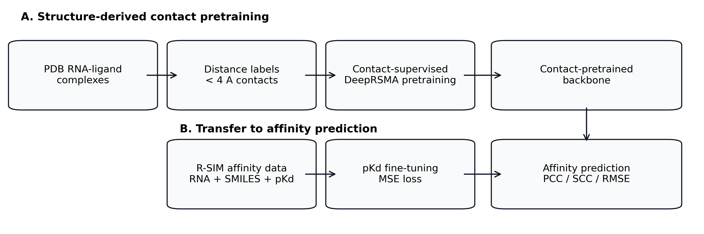

**图 1. Contact-supervised backbone overview。** StructRSMA 首先保留 DeepRSMA 的 RNA sequence、RNA graph、molecule sequence 和 molecule graph 四个分支，并使用原 cross-fusion module 得到 RNA-ligand interaction representation。随后，PDB-derived nucleotide-atom contact maps 被用于结构接触预训练，并为后续 SCA 提供 contact prior。

### 2.3 PDB-derived contact map 构建

本文从 PDB RNA-ligand complexes 中自动构建 contact supervision。对于每个复合物，解析 RNA chain 和 ligand heavy atoms，计算 nucleotide 与 ligand atom 的最近距离。若距离小于 4 Angstrom，则标记为 positive contact。

构建流程如下：

1. 查询包含 RNA polymer 和非聚合小分子的 PDB structures。
2. 过滤水、常见离子、异常 ligand 和不满足距离条件的样本。
3. 解析 RNA nucleotide 坐标和 ligand heavy atom 坐标。
4. 生成 \(p \times q\) binary contact map。
5. 保存 RNA sequence、ligand SMILES、ligand graph 和 contact map。

最终得到 Contact500 数据集，共 484 个可用 RNA-ligand contact samples。为评估潜在数据泄漏，还构建了 de-overlap Contact500：通过 ligand Tanimoto similarity 和 RNA sequence window identity 移除与 independent test 相似的样本，保留 440 个 samples。

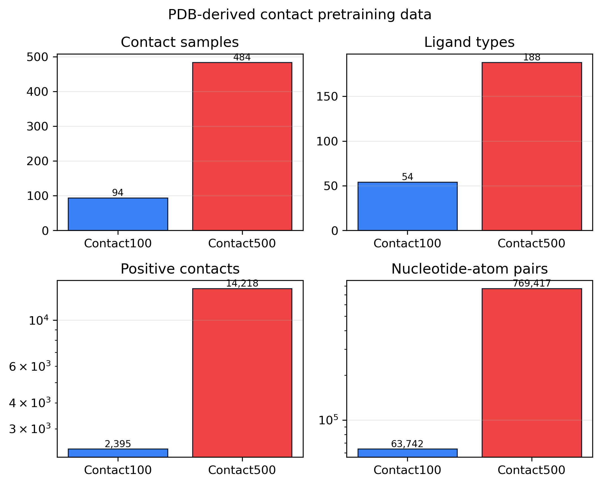

**图 2. PDB-derived contact dataset statistics。** 扩大 PDB contact pretraining 数据后，样本数、ligand 类型、positive contacts 和 nucleotide-atom pairs 均显著增加。

### 2.4 Contact prediction head

设 cross-fusion 后第 \(i\) 个 RNA nucleotide embedding 为 \(r_i\)，第 \(j\) 个 ligand atom embedding 为 \(m_j\)。Contact head 使用 pairwise MLP 预测 contact logit：

\[
s_{ij} = \mathrm{MLP}([r_i, m_j, r_i \odot m_j]),
\]

其中 \(\odot\) 表示 element-wise multiplication。所有 pairwise logits 构成 contact logit matrix：

\[
S \in \mathbb{R}^{p \times q}.
\]

由于 contact map 中正样本比例很低，本文使用 focal loss 作为 contact pretraining 目标：

\[
\mathcal{L}_{contact}
= -\alpha(1-p_t)^\gamma \log(p_t),
\]

其中 \(\alpha=0.75\)，\(\gamma=2.0\)。

### 2.5 两阶段结构监督训练

StructRSMA 的第一阶段为结构接触预训练：

\[
R, M \rightarrow C.
\]

模型在 PDB-derived contact map 上学习 nucleotide-atom contact prediction，优化目标为：

\[
\mathcal{L}_{stage1}=\mathcal{L}_{contact}.
\]

第二阶段为亲和力微调：

\[
R, M \rightarrow \hat{y}.
\]

模型迁移 contact-pretrained backbone 到 R-SIM affinity dataset，并使用 MSE loss 训练 pKd prediction：

\[
\mathcal{L}_{affinity} = \mathrm{MSE}(\hat{y}, y).
\]

在 Contact500SkipAff 设置中，迁移 contact-pretrained backbone，但跳过 contact pretraining 阶段未充分训练的 affinity head，使下游 affinity head 在 R-SIM 上重新学习。

### 2.6 Structural Contact Adapter (SCA)

在完成 Contact500SkipAff fine-tuning 后，StructRSMA 进一步引入 Structural Contact Adapter (SCA)。SCA 的设计目标不是替代 DeepRSMA backbone，也不是重新训练一个更大的主干网络，而是在保留 base affinity predictor 的基础上，利用 contact prior 对四视图表示进行轻量级残差校准。

SCA 接收四个 pooled view vectors：

\[
H=[h_{RS},h_{RG},h_{MS},h_{MG}],
\]

分别对应 RNA sequence view、RNA graph view、molecule sequence view 和 molecule graph view。与此同时，contact head 根据 cross-fusion token representations 输出 nucleotide-atom contact probability matrix \(P\)。StructRSMA 从 \(P\) 中提取四个结构接触统计量：

\[
c=[density, max\_prob, rna\_focus, atom\_focus].
\]

其中 \(density\) 表示整体预测接触强度，\(max\_prob\) 表示最强局部接触概率，\(rna\_focus\) 和 \(atom\_focus\) 分别描述 contact prior 在 RNA nucleotide 和 ligand atom 维度上的集中程度。

SCA 首先根据四个 view vectors 和 contact statistics 生成 view gate：

\[
g=\mathrm{softmax}(\mathrm{MLP}([H,c])).
\]

然后得到 contact-prior value vector：

\[
z_{contact}=W_c\sum_k g_k h_k.
\]

该向量可以理解为被结构接触先验调制后的全局校准信号。随后，SCA 在四个 view vectors 之间执行轻量级 attention 更新：

\[
A=\mathrm{softmax}\left(\frac{Q(H)K(H)^T}{\sqrt{d}}\right),
\]

\[
H'=\mathrm{LN}(H+A(V(H)+z_{contact})).
\]

最后，refined view vectors 与 contact statistics 拼接后输入 residual MLP，输出 affinity correction：

\[
\Delta y_{SCA}=\mathrm{MLP}([\mathrm{Flatten}(H'),c]).
\]

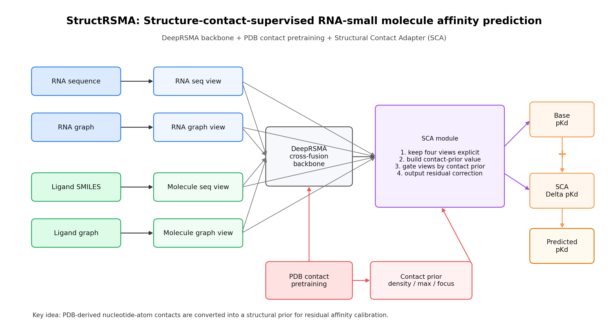

**图 3. StructRSMA method overview。** SCA 在 DeepRSMA backbone 和 contact-supervised fine-tuning 之后执行结构接触适配。Contact prior 不直接替代 affinity head，而是产生一个残差校准项，使 PDB-derived contact knowledge 能够影响最终 pKd prediction。

### 2.7 SCA residual calibration

为了避免新增模块破坏已训练好的 Contact500SkipAff 模型，本文采用 residual calibration 设计。具体而言，首先加载已经 fine-tune 好的 Contact500SkipAff checkpoint，并冻结原模型参数；随后只训练新增的 SCA。预测值写作：

\[
\hat{y}_{StructRSMA}=\hat{y}_{base}+\Delta y_{SCA}.
\]

其中 \(\hat{y}_{base}\) 为 Contact500SkipAff 输出，\(\Delta y_{SCA}\) 为 SCA 学到的 contact-prior-guided residual correction。SCA residual head 最后一层采用零初始化，因此训练开始前模型输出严格等于原 Contact500SkipAff 输出。这一设置保证新模块是在已有最好方案后进行增量增强，而不是重新训练一个不可控的新模型。
### 2.8 对照实验设计

本文设置以下对照实验：

**Shuffled contact control。** 在每个 PDB 样本内随机打乱 contact map，保持 positive contact 数量和 contact density 不变，但破坏 nucleotide-atom correspondence。若 shuffled model 无法复现真实 contact model 的效果，则说明有效信号来自真实物理接触关系。

**De-overlap control。** 移除与 independent test 在 ligand fingerprint 或 RNA sequence 上相似的 PDB contact samples，用于评估 contact pretraining 是否依赖潜在数据重叠。

**Contact data scaling。** 比较 0、94 和 484 个 contact samples 对下游 affinity prediction 的影响，评估结构监督规模是否带来可扩展收益。

**StructRSMA comparison。** 比较 Contact500SkipAff 与 StructRSMA，评估 SCA 是否在已有 contact-supervised backbone 上进一步提升性能。

## 3. 实验设置

### 3.1 数据集

本文主要使用两个来源的数据。

**R-SIM affinity dataset。** 使用 DeepRSMA 复现代码中的 independent setting。训练集用于 pKd fine-tuning，independent test 用于最终 affinity evaluation。该设置与原 DeepRSMA independent-test 协议一致。

**PDB-derived contact datasets。** 从 PDB RNA-ligand structures 中构建 nucleotide-atom contact map。Contact100 包含 94 个 samples；Contact500 包含 484 个 samples；de-overlap Contact500 在移除与 independent test 相似样本后保留 440 个 samples。

| 数据集 | 样本数 | 标签类型 | 用途 |
|---|---:|---|---|
| R-SIM train | 140 | pKd | affinity fine-tuning |
| R-SIM independent test | 48 | pKd | independent evaluation |
| Contact100 | 94 | nucleotide-atom contact map | contact pretraining ablation |
| Contact500 | 484 | nucleotide-atom contact map | main contact pretraining |
| De-overlap Contact500 | 440 | nucleotide-atom contact map | leakage-aware control |

**表 1. 本文使用的数据集。**

### 3.2 Baselines

本文关注以下模型设置：

- **Original DeepRSMA：** 复现原 DeepRSMA independent-test setting。
- **Contact100SkipAff：** 使用 Contact100 contact pretraining 后迁移到 affinity task。
- **Contact500SkipAff：** 使用 Contact500 contact pretraining 后迁移到 affinity task。
- **ShuffledContact500：** 使用 shuffled contact labels 进行 contact pretraining。
- **StructRSMA：** 在 Contact500SkipAff checkpoint 后接入并训练 SCA residual adapter。

### 3.3 评价指标

Affinity prediction 使用三个指标：

\[
PCC=\frac{\sum_i(y_i-\bar{y})(\hat{y}_i-\bar{\hat{y}})}
{\sqrt{\sum_i(y_i-\bar{y})^2}\sqrt{\sum_i(\hat{y}_i-\bar{\hat{y}})^2}},
\]

PCC 衡量预测值与真实值的线性相关性。

SCC 为 Spearman rank correlation，衡量预测排序与真实排序的一致性。

\[
RMSE=\sqrt{\frac{1}{n}\sum_i(\hat{y}_i-y_i)^2}.
\]

RMSE 衡量预测数值误差，数值越低越好。

Contact prediction 使用 top-k precision、AUPRC 和 AUROC。对于每个样本，top-k precision 中的 \(k\) 设置为该样本真实 positive contact 数。

## 4. 结果

### 4.1 PDB-derived contact pretraining 能学习真实接触模式

首先评估模型是否能从 PDB-derived contact maps 中学习有效 nucleotide-atom contact pattern。图 4 显示，contact pretraining 过程中 validation top-k precision 明显高于 contact density baseline，说明模型并非随机预测 contact，而是能够富集真实接触位置。

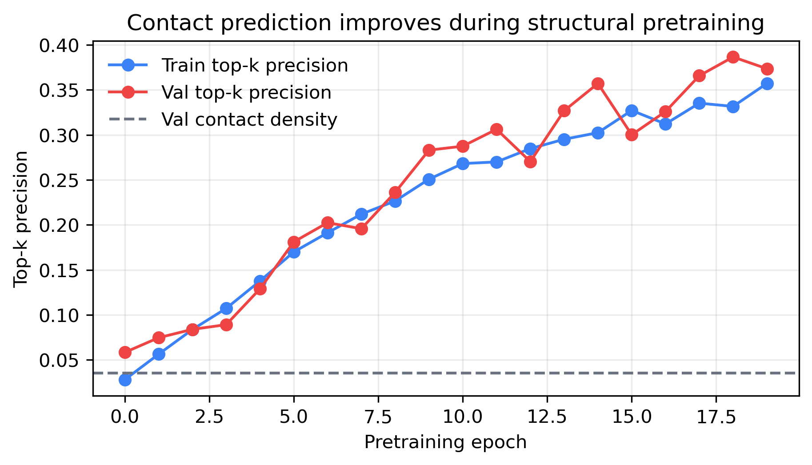

**图 4. Contact pretraining curve。** 模型在 PDB-derived contact maps 上训练后，validation top-k precision 随训练提升，并明显高于 contact density baseline。

表 2 总结 contact prediction 结果。真实 Contact500 显著优于 shuffled-label control。De-overlap Contact500 在移除相似样本后仍取得较高 top-k precision、AUPRC 和 AUROC，说明模型学习到的结构接触模式不完全依赖数据重叠。

| Contact pretraining | Top-k precision | AUPRC | AUROC | Contact density |
|---|---:|---:|---:|---:|
| True Contact500 | 0.3471 | 0.2847 | 0.8828 | 0.0211 |
| Shuffled Contact500 | 0.0261 | 0.0571 | 0.7327 | 0.0211 |
| De-overlap Contact500 | **0.3817** | **0.3678** | **0.9408** | 0.0175 |

**表 2. Contact prediction performance。**

### 4.2 Shuffled-label control 证明接触监督不是额外预训练带来的偶然收益

为了验证 contact labels 的物理意义，本文构建 shuffled contact control。该对照保持每个样本 positive contact 数量不变，但打乱 nucleotide-atom 对应关系。结果显示，shuffled model 在 top-k precision 和 AUPRC 上明显低于 true contact model。

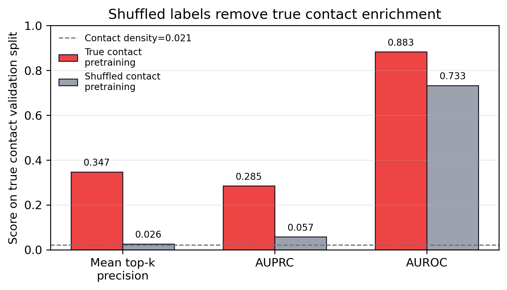

**图 5. Shuffled-label control on contact prediction。** 打乱 nucleotide-atom correspondence 后，模型无法有效恢复真实 contact prediction performance。

该结果说明，contact pretraining 的收益不是简单来自更多 PDB 数据或更多训练轮数，而是来自真实 nucleotide-atom physical contact relationship。

### 4.3 Contact500 pretraining 提升 independent-test affinity prediction

在 DeepRSMA 原论文式 independent-test protocol 下，Contact500SkipAff 相比 Original DeepRSMA 在 PCC、SCC 和 RMSE 上均取得提升。

| 方法 | Selection | Seeds | PCC | SCC | RMSE |
|---|---:|---:|---:|---:|---:|
| Original DeepRSMA | best-PCC | 3 | 0.4866 +/- 0.0522 | 0.4912 +/- 0.0523 | 1.0584 +/- 0.1490 |
| Contact100SkipAff | best-PCC | 3 | 0.5195 +/- 0.0333 | 0.5257 +/- 0.0194 | 0.9754 +/- 0.0380 |
| Contact500SkipAff | best-PCC | 3 | **0.5816 +/- 0.0547** | **0.5749 +/- 0.0590** | **0.9152 +/- 0.0788** |
| Original DeepRSMA | best-RMSE | 3 | 0.4614 +/- 0.0613 | 0.4471 +/- 0.0855 | 0.9298 +/- 0.0318 |
| Contact500SkipAff | best-RMSE | 3 | **0.5738 +/- 0.0495** | **0.5902 +/- 0.0204** | **0.8665 +/- 0.0400** |

**表 3. Affinity prediction results under the reproduced independent-test protocol。**

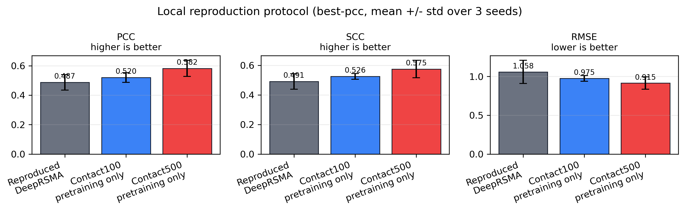

**图 6. Independent-test performance under best-PCC selection。**

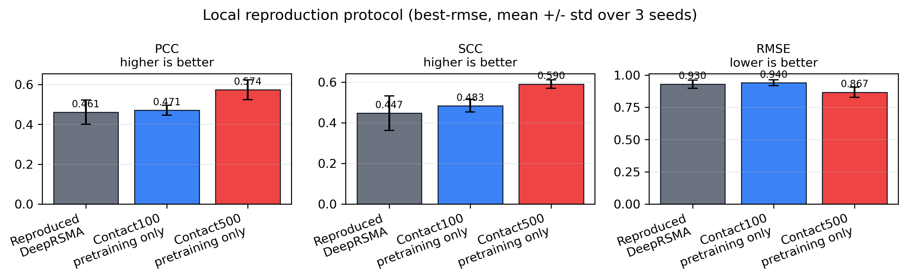

**图 7. Independent-test performance under best-RMSE selection。**

结果显示，Contact500SkipAff 将 PCC 从 0.4866 提升至 0.5816，同时将 RMSE 从 1.0584 降低至 0.9152。这说明 PDB-derived contact supervision 能够迁移到没有 contact labels 的 R-SIM affinity prediction task。

### 4.4 Contact pretraining data scaling 带来可扩展收益

为评估结构监督数据规模的影响，本文比较无 contact pretraining、Contact100 和 Contact500 三种设置。随着 PDB contact samples 从 0 增加到 94 和 484，downstream affinity performance 总体提升。

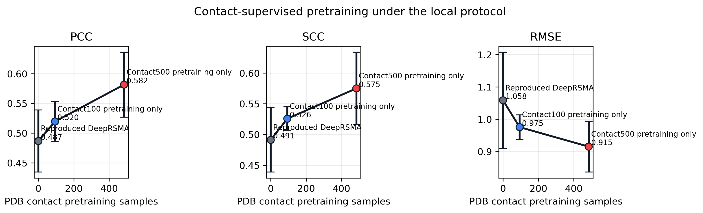

**图 8. Scaling effect of contact-supervised pretraining。** 扩大 PDB-derived contact supervision 后，下游 PCC/SCC 提升，RMSE 降低。

该结果支持本文的基本假设：PDB 中可自动生成的结构接触标签可以作为可扩展的外部监督源。

### 4.5 Downstream shuffled-contact control 进一步验证真实 contact label 的作用

在 downstream pKd prediction 中，真实 contact pretraining 明显优于 shuffled contact pretraining。表 4 使用 best-RMSE selection 展示三种子结果。

| 方法 | Selection | PCC | SCC | RMSE |
|---|---|---:|---:|---:|
| Original DeepRSMA | best-RMSE | 0.4614 +/- 0.0613 | 0.4471 +/- 0.0855 | 0.9298 +/- 0.0318 |
| ShuffledContact500 | best-RMSE | 0.3909 +/- 0.0389 | 0.3837 +/- 0.0699 | 0.9669 +/- 0.0172 |
| TrueContact500 | best-RMSE | **0.5738 +/- 0.0495** | **0.5902 +/- 0.0204** | **0.8665 +/- 0.0400** |

**表 4. Downstream shuffled-contact control。**

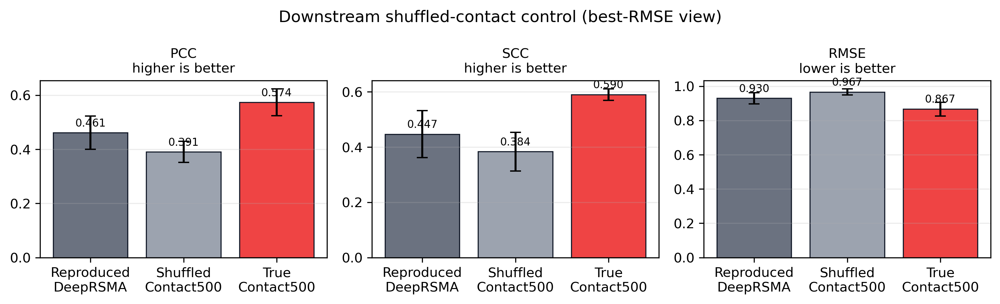

**图 9. Downstream shuffled-contact control。** 随机 contact labels 无法复现真实 contact pretraining 的下游收益。

### 4.6 StructRSMA 进一步提升 Contact500SkipAff

为使结构接触先验进一步参与下游亲和力预测，本文提出 SCA module。该模块接在已经 fine-tune 好的 Contact500SkipAff checkpoint 后，并冻结原模型参数，仅训练新增 residual adapter。

训练前，SCA residual head 最后一层零初始化，因此模型输出严格等于 Contact500SkipAff。训练后，SCA 在三种子平均上进一步提升 PCC、SCC，并降低 RMSE。

| 方法 | Selection | Seeds | PCC | SCC | RMSE |
|---|---:|---:|---:|---:|---:|
| Contact500SkipAff | initial best-PCC checkpoint | 3 | 0.5816 +/- 0.0547 | 0.5749 +/- 0.0590 | 0.9152 +/- 0.0788 |
| StructRSMA | best-PCC | 3 | **0.5870 +/- 0.0590** | **0.5844 +/- 0.0663** | **0.8696 +/- 0.0451** |
| StructRSMA | best-SCC | 3 | 0.5786 +/- 0.0712 | **0.6038 +/- 0.0428** | 0.8671 +/- 0.0450 |
| StructRSMA | best-RMSE | 3 | 0.5792 +/- 0.0602 | 0.5873 +/- 0.0325 | **0.8518 +/- 0.0419** |

**表 5. Effect of StructRSMA with Structural Contact Adapter。**

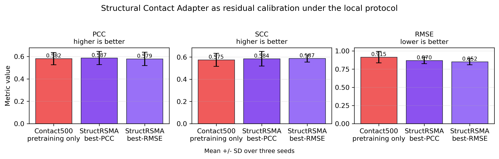

**图 10. StructRSMA performance。** 在 Contact500SkipAff 后接入 SCA 后，三种子平均 RMSE 明显下降，同时 PCC 和 SCC 也有提升。

Per-seed best-PCC results 如下：

| Seed | Initial PCC | Initial SCC | Initial RMSE | SCA PCC | SCA SCC | SCA RMSE | SCA epoch |
|---:|---:|---:|---:|---:|---:|---:|---:|
| 1 | 0.6072 | 0.6118 | 0.8331 | 0.6199 | 0.6395 | 0.8438 | 26 |
| 2 | 0.5188 | 0.5069 | 0.9902 | 0.5189 | 0.5109 | 0.9217 | 2 |
| 3 | 0.6188 | 0.6060 | 0.9223 | 0.6223 | 0.6029 | 0.8433 | 39 |

这些结果表明，SCA 对不同 seed 的作用略有差异。Seed 1 中相关性提升最明显；seed 2 中 RMSE 改善更明显；seed 3 中 PCC 和 RMSE 均有一定提升。总体来看，SCA 在保留原最好模型的基础上提供了进一步增益。

### 4.7 Contact map 与结构可解释性

除全局 affinity performance 外，本文还评估模型是否能够定位 RNA-ligand 接触区域。图 11 展示 PDB 3F4H / ligand RS3 的 contact map case study。真实 contact map 中共有 23 个 positive contacts，涉及 5 个 nucleotides 和 16 个 ligand atoms。模型预测 top-k contact pairs 中有 10 个命中真实 contact，top-k precision 为 0.435。

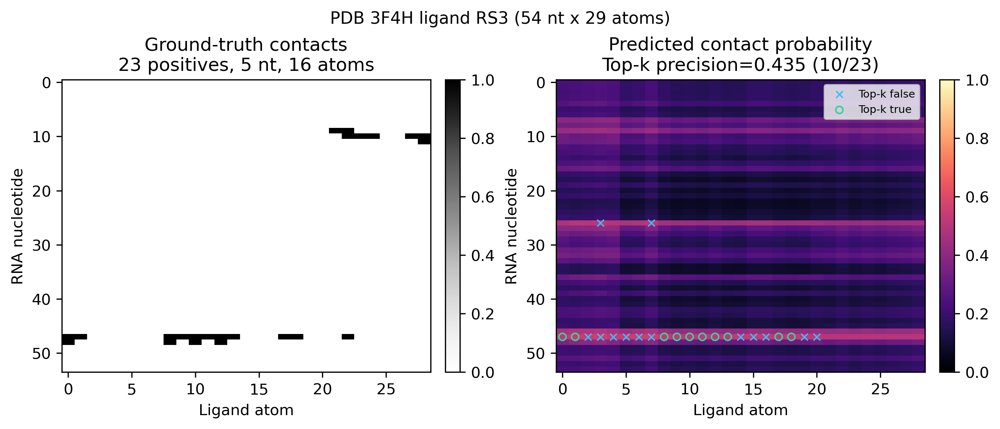

**图 11. Nucleotide-atom contact map example。** 左侧为真实 contact map，右侧为模型预测 contact probability。绿色圆圈表示 top-k true positives，蓝色叉号表示 top-k false positives。

为了让 contact map 更具生物结构直观性，本文进一步将预测结果映射回 PDB 三维结构。图 12 展示 RNA backbone、ligand atoms、真实接触 nucleotides 和模型命中的 top-k contacts。

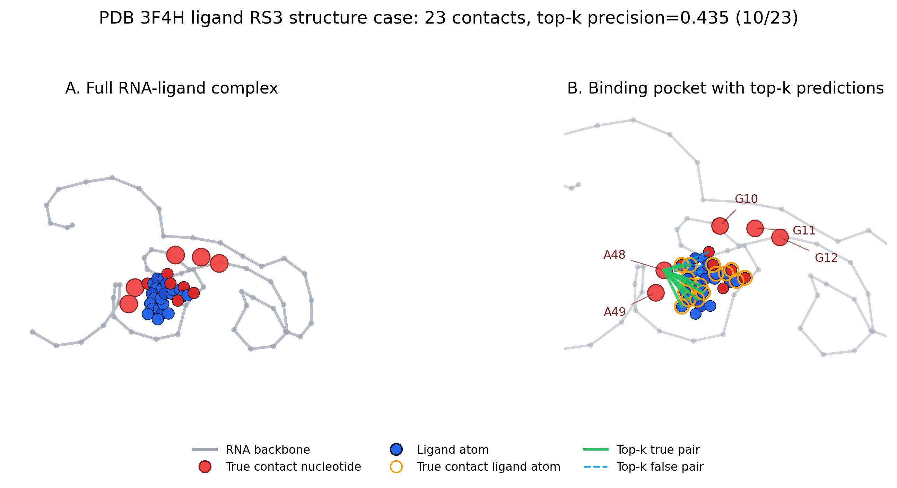

**图 12. Structure-level interpretability case study。** 模型预测的高概率 contact pairs 能够部分落在真实 ligand-binding pocket 附近，说明 contact supervision 能为 affinity prediction 提供结构可解释性。

该结果说明，本文模型不只是输出一个 pKd 数值，还能提供 nucleotide-atom interaction 层面的解释线索。这一点对于 RNA-targeted drug design 中的 binding pocket analysis 和 ligand optimization 具有潜在价值。

### 4.8 Validation-selected protocol 的初步诊断

原 DeepRSMA 复现协议会在 independent test 上每个 epoch 评估并报告最佳指标，这与原论文表格保持一致，但存在 test-set checkpoint selection 的风险。为评估更严格场景，本文额外实现 validation-selected/refit protocol：从训练集中划分 internal validation，以 validation RMSE 选择 epoch，再使用 full training set refit 到该 epoch，最后在 independent test 上评估一次。

初步 seed 1 结果显示，严格 protocol 下 Contact500SkipAff 尚未稳定超过 Original DeepRSMA。该现象可能与 R-SIM training set 较小、validation split 不稳定、independent test 仅 48 个样本以及 epoch selection variance 有关。

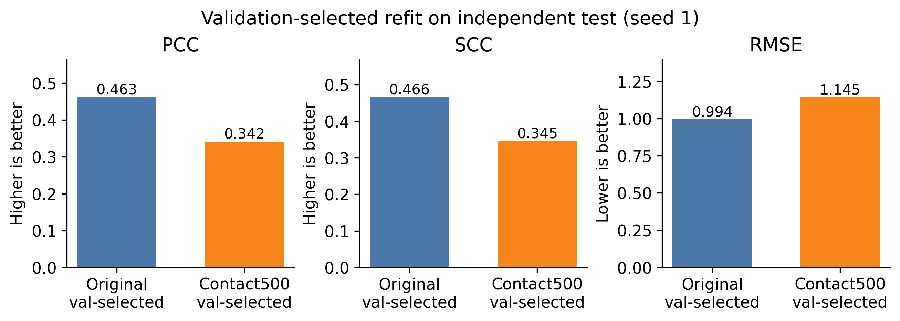

**图 13. Validation-selected/refit diagnostic。** 更严格的 validation-selected protocol 暴露了当前模型在小样本场景下的稳定性问题。

因此，本文主结果仍以复现原 DeepRSMA independent-test protocol 为主，同时在讨论中明确指出：未来需要使用更稳定的 validation strategy、repeated validation splits 或 external blind datasets 来进一步验证模型泛化能力。

## 5. 讨论

### 5.1 与 DeepRSMA 的区别

DeepRSMA 的核心贡献是四视图特征提取和 RNA-ligand cross-fusion。本文保留该主干，并在两个层面进行扩展。

第一，本文引入 PDB-derived nucleotide-atom contact supervision，使模型能够在 affinity fine-tuning 之前学习局部物理接触模式。这一点弥补了 R-SIM affinity labels 只提供全局 pKd 的不足。

第二，本文在 Contact500SkipAff 后加入 SCA，使 contact prior 不只作为预训练标签存在，还参与下游 affinity residual calibration。换言之，本文从“结构监督预训练”进一步推进到“结构先验驱动的亲和力校准”。

### 5.2 与现有多视图融合方法的区别

现有多视图融合方法通常强调在融合阶段保留不同来源的 sequence view 和 graph view，并通过 attention 或 gated fusion 建模视图间互补关系。StructRSMA 与这类方法的共同点是保留四视图信息，但方法重点并不只是设计一个更复杂的 attention block。

StructRSMA 的核心差异在于：SCA 的校准信号由 PDB-derived nucleotide-atom contact prior 调制。也就是说，本文不是简单增加一个多视图 attention block，而是把来自 PDB 结构监督的 contact map 转化为影响下游 pKd prediction 的结构先验。

此外，本文采用 residual adapter 方式接入 SCA。该设计能够保留已训练好的 Contact500SkipAff 能力，并通过零初始化 residual head 保证新模块训练前不改变原模型输出。这种设置更适合小样本 affinity prediction，因为它降低了新模块过拟合或破坏原模型的风险。

### 5.3 为什么 contact supervision 有效

RNA-ligand binding affinity 最终由一系列局部相互作用共同决定，包括 stacking、hydrogen bonding、electrostatic interaction、shape complementarity 和 local pocket geometry。虽然本文没有显式建模每一种化学作用类型，但 nucleotide-atom contact map 提供了最基础的空间邻近监督。模型通过 contact pretraining 学到哪些 RNA nucleotide 和 ligand atom 更可能接近，从而为下游 affinity prediction 提供结构归纳偏置。

Shuffled-label control 支持这一解释。若仅仅增加 PDB 数据或训练轮数即可提升性能，则 shuffled contact pretraining 也应带来类似收益。但实验显示 shuffled labels 在 contact task 和 downstream pKd task 上均明显弱于真实 contact labels，说明真实 contact correspondence 是关键。

### 5.4 局限性

本文仍存在若干局限。

首先，当前主结果采用原 DeepRSMA independent-test checkpoint selection protocol。虽然这有利于与原论文复现设置对齐，但严格来说仍需要 validation-selected 或 external blind test 进一步验证泛化性。

其次，R-SIM independent test 样本数较小，仅 48 个 pairs。小样本测试集会放大 seed 和 epoch selection 的影响。因此后续需要更多 independent RNA-ligand benchmarks。

第三，contact map 标签由 4 Angstrom distance cutoff 自动生成。这一规则简单、可扩展，但无法区分 hydrogen bond、base stacking、metal-mediated interaction 等具体相互作用类型。

第四，SCA 的提升幅度仍较温和。三种子平均 PCC 从 0.5816 提升到 0.5870，RMSE 从 0.9152 降低到 0.8696，说明方向有效，但投稿前仍建议补充 statistical test、消融实验和更严格验证。

## 6. 结论

本文提出 StructRSMA，一种面向 RNA-小分子结合亲和力预测的结构接触监督适配网络。该方法首先从 PDB RNA-ligand complexes 中自动生成 nucleotide-atom contact maps，并通过 contact pretraining 让 DeepRSMA backbone 学习局部物理接触模式。随后，本文提出 Structural Contact Adapter，将 contact prior 用作下游 affinity residual calibration 的结构先验，在保留 Contact500SkipAff 已有能力的基础上进一步提升 affinity prediction。

实验结果表明，真实 contact pretraining 在 contact prediction task 上显著优于 shuffled-label control，并能迁移提升 R-SIM independent-test affinity prediction。进一步加入 SCA 后，三种子平均 PCC、SCC 和 RMSE 均优于 Contact500SkipAff baseline。结构可解释性分析显示，模型能够在 PDB case study 中部分定位真实 RNA-ligand contact pocket。

总体而言，StructRSMA 证明了 PDB-derived nucleotide-atom contact supervision 对 RNA-targeted small molecule binding prediction 的价值，并为构建兼具预测性能和结构可解释性的 RNA-ligand deep learning model 提供了可行路线。

## 参考文献占位

1. Huang Z, Wang Y, Chen S, Tan YS, Deng L, Wu M. DeepRSMA: a cross-fusion-based deep learning method for RNA-small molecule binding affinity prediction. Bioinformatics, 2024.
2. DeepMIF: A Multiview Interactive Fusion-Based Deep Learning Method for RNA-Small Molecule Binding Affinity Prediction. Journal of Chemical Information and Modeling, 2026.
3. Chen et al. RNA-FM related reference.
4. SPOT-RNA-2D related reference.
5. R-SIM dataset related reference.

## 附：当前可用于论文排版的图表文件

主要图片：

- `docs/figures/fig_method_overview.png`
- `docs/figures/fig_sca_method_overview.png`
- `docs/figures/fig_contact_dataset_summary.png`
- `docs/figures/fig_contact_pretrain_curve.png`
- `docs/figures/fig_contact_shuffle_control.png`
- `docs/figures/fig_performance_best_pcc.png`
- `docs/figures/fig_performance_best_rmse.png`
- `docs/figures/fig_contact_data_scaling.png`
- `docs/figures/fig_downstream_shuffle_control.png`
- `docs/figures/fig_sca_adapter_results.png`
- `docs/figures/fig_contact_map_example.png`
- `docs/figures/fig_structure_case_3f4h.png`
- `docs/figures/fig_validation_protocol_seed1.png`

主要表格：

- `docs/tables/structrsma_sca_summary.csv`
- `docs/tables/pdb_contact_deoverlap_l80_r80_kept.csv`
- `docs/tables/pdb_contact_deoverlap_l80_r80_excluded.csv`

